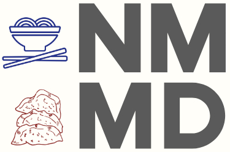
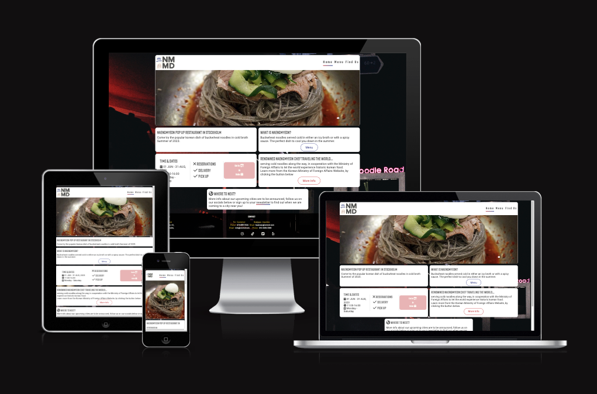
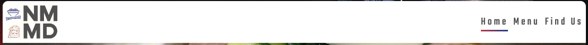
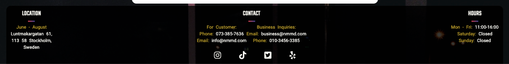
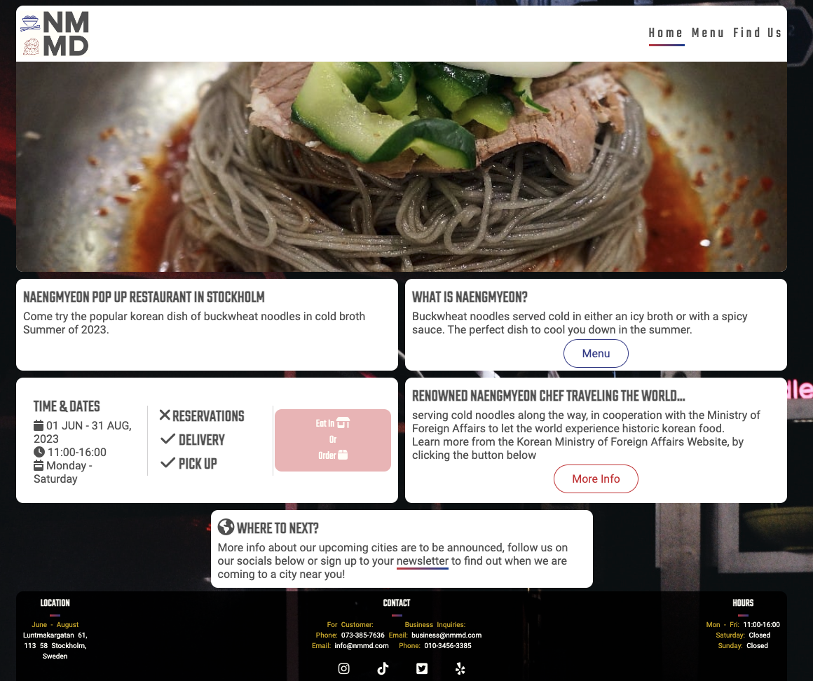
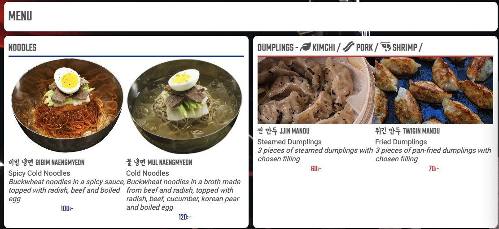
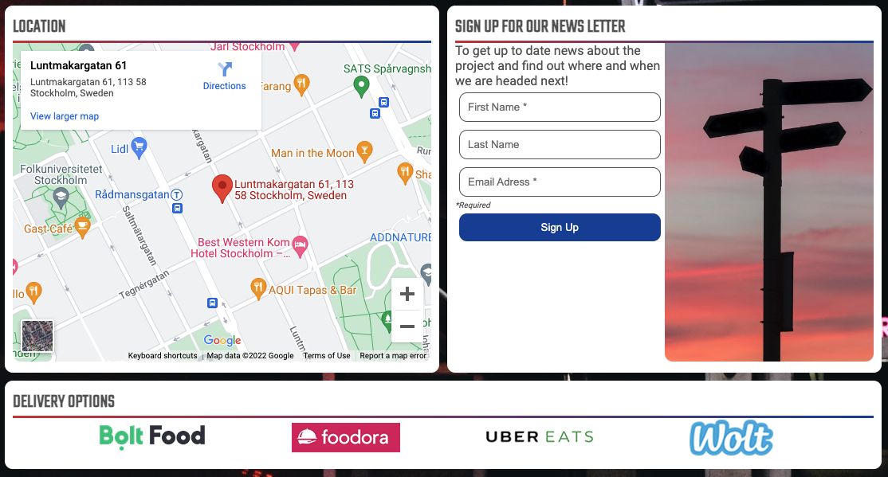
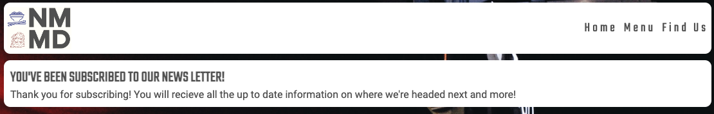

# The purpouse of this project
This static website was made for a fictional campaign from the Korean MOFA to promote their culture through food by having a renowned chef of this particular dish travel around the world, opening pop up restaurants along the way.

The reasons for the creation of this website as is, it is the first project of five from The Code Institute. The requirements for project 1 is to build a website using only HTML5 and CSS3.

The websites target audience is people whom are interested in korean culture, people that are interested in asian cuisine. It is aming to provide all the necessary info for the peole whom are in the target audience aswell as drawing in more people to it.

# Table of Content
+ [UX](#ux "UX")
  + [User Demographic](#user-demographic "User Demographic")
  + [User Stories](#user-stories "User Stories")
    + [Existing Members](#existing-members "Existing Members")
    + [New Users](#new-users "New Users")
  + [User Goals](#user-goals "User Goals")
  + [Requirements](#requirements "Requirements")
  + [Design](#design "Design")
    + [Colours](#colours "Colours")
    + [Typography](#typography "Typography")
    + [Images](#images "Images")
+ [Features](#features "Features")
  + [Existing Features](#existing-features "Existing Features")
    + [Header and Navigation Section](#header-and-navigation-section "Header and Navigation Section")
    + [Hero Header Section](#hero-header-section "Hero Header Section")
    + [About us Section](#about-us-section "About us Section")
    + [2022 Events Section](#2022-events-section "2022 Events Section")
    + [Contact and Registration Section](#contact-and-registration-section "Contact and Registration Section")
    + [Footer Section](#footer-section "Footer Section")
    + [Form-dump page](#form-dump-page "Form-dump page")
  + [Features Left to Implement](#features-left-to-implement "Features Left to Implement")
+ [Technologies used](#technologies-used "Technologies used")
+ [Testing](#testing "Testing")
  + [Validator Testing](#validator-testing "Validator Testing")
  + [Unfixed Bugs](#unfixed-bugs "Unfixed Bugs")
+ [Development and Deployment](#development-and-deployment "Development and Deployment")
+ [Content](#content "Content")
+ [Media](#media "Media")
+ [Credits](#credits "Credits")

## UX

### Scope

#### Website Demographic
- People whom are interested in Korean Food, Korean Culture.
- People looking to experience the menu at the restaurant.
- People in the current host city looking for information on when/where the resturant is open.
- People looking for a place to eat.

#### Website Goals
 - Provide a good first impression of the concept of Cold Noodles.
 - Having all information about times, location, ordering options clear and easily accesbile.
 - Giving people an option to get information about the journey of the pop up tour.
 - Facilitating a good impression of korean culture.

### Design

#### Basic concept
As the subject matter is very foreign for a western audience, the design and conventions need to be more familiar. Hence the western style layout and a focus on the menu and basic information. 

The concept of the website is to increase exposure of other parts of the korean culture through food. The knee-jerk reaction would be long paragraphs about history of the food, but my approach is that that can be found elsewhere. We only need to hint to that, and the people can find it on their own. That is also the reason we have clear sections and pages, so people can find what they want quickly.

#### Colours
The colour palette is based on the colours of the South Korean flag, with yellow being a nod to their past more colourful flag from the past, with the exception of not quite charcoal but dark gray, I chose to go for a dark gray since I felt it contrasted better to the white page and I'm sure that some influence is from the Love Running Project.

Colour Palette reference from [Coolors](https://fontawesome.co/).

#### Typography

I got the fonts I used from [FontJoy](https://fontjoy.com/). I Used Teko for headings and Roboto for body text. I also manually searched for the korean font Yeon Sung on [GoogleFonts](https://fonts.google.com/).

#### Images

The images were chosen based on colour and on content, each image can be interpreted to the meaning of what it's used for.

I used [Unsplashed](https://unsplash.com/) free photos for my images.
The images not taken from Unsplashed are the images of the noodles and the images for the delivery options.

## Features

A website split over three pages; Home, Menu, Find Us.

### Existing Features

### Site Wide Elements

#### Navigation Bar
- The navbar consists of a logo and the navigation links to all the pages
- Highlighting the active page and hover effect (Nod to, but not exclusively Love Running Project)
- Responsive design with the card and logo resizing to fit the screen.
- It can either be a seperate card or it can be included to a big main card, as is on the home page. Example of the two below

#### Footer
- Information about how to reach us by email or phone for business and for customer concerns
- Location of the current restaurant and the months operating.
- Opening hours
- Social media on the bottom, taken some insparation from Love Running.
- All but the opening hours are clickable, new page for email/phone/google location/website depending on what it is.
- Responsive, aligning vertically when hitting a certain breakpoint.
- The footer is see through to differentiate it form the rest of the cards and to make it fade into the background unless you're looking for it.
- Footer is stuck to bottom to for the same reason as above.

### Background
- Covers whole screen and the cards go to a maximum of 1100px
- With the card order being differend and the background showing more than 10px at the time between the cards, the website looks very different between devices.

### By Page

#### Home Page
- Hero Image that has a dynamic width but a fixed height, making it feel dynamic. Showing off the noodles fron and center to make no mistake what the concept of the restaurant is.
- Information served as cards, on a desktop it shows them two per row and one per row on smaller screens.
- Cards have hover effects and are fully responsive. The cards make the information easily digestible and there is corresponding buttons to navigate you to the topic of the card.
- Buttons have hover effects and all the links leaving the site are open in new tabs.

#### Menu Page
- Shows off the menu items with a small description and price, the focus is on the menu items.
- The noodles and dumplings are on different cards, making it clear that there are two choices to be made, one per card, left or right (or up or down depending on screen size).

#### Find Us Page
- Divided into three sections, Locations, Newsletter sign up, delivery options. As every other card on the site, everything is clearly labled so if you're looking for a specific piece of information you can easily skim through.
- The location card is big enough to see what you are looking at and everythign is clear. Sharing the row with the news letter card.
- The News Letter card is only asking for the bare minimum, the email you want the information on, your first name as knowing last name is not necessary. The picture on the right fits the colors of the website and the content fits the puropuse.
- The Delivery options card is a full width and it's a decision I took because much like the width of the card, we have a wide option of delivery partners.

#### Newsletter Signup Success
- Page for providing feedback that the newsletter sign up worked.

### Features Left to Implement
- Admin portal that allows for adding, removing & editing of cards.

## Technologies used

- [HTML](https://en.wikipedia.org/wiki/HTML)
- [CSS](https://en.wikipedia.org/wiki/CSS)

## Testing
As the project progressed the repsonsiveness and expeced behaviour has been tested and confirmed on chrome on android and on chrome and safari on desktop/laptop screen sizes.

In addition the Google DevTools have been used to test other form-factors not available to me during this project.

### List of bugs squashed.
- Having black marker dots show up in the menu. 
    - Fix: Change from Unordered list and List Items to divs.
- Max width of website not being "respected" by some elements.
    - Fix: Changing Box-sizing to Border-Box
- No images loaded in when publishing on Github pages
    - Fix: fixed the links, I had added an unnecessary "/" ahead of "assets"
- Sometimes stuff not working as intended initially
    - Fix: write the tags properly and properly close off said tags.

### Validator Testing
- HTML
    - Some errors were returned from the validator, easily deletable small remnants of old code. [W3C Validator](https://validator.w3.org/nu/?doc=https%3A%2F%2Ffrnbdn.github.io%2FNMMD%2Findex.html)
- CSS
    - 